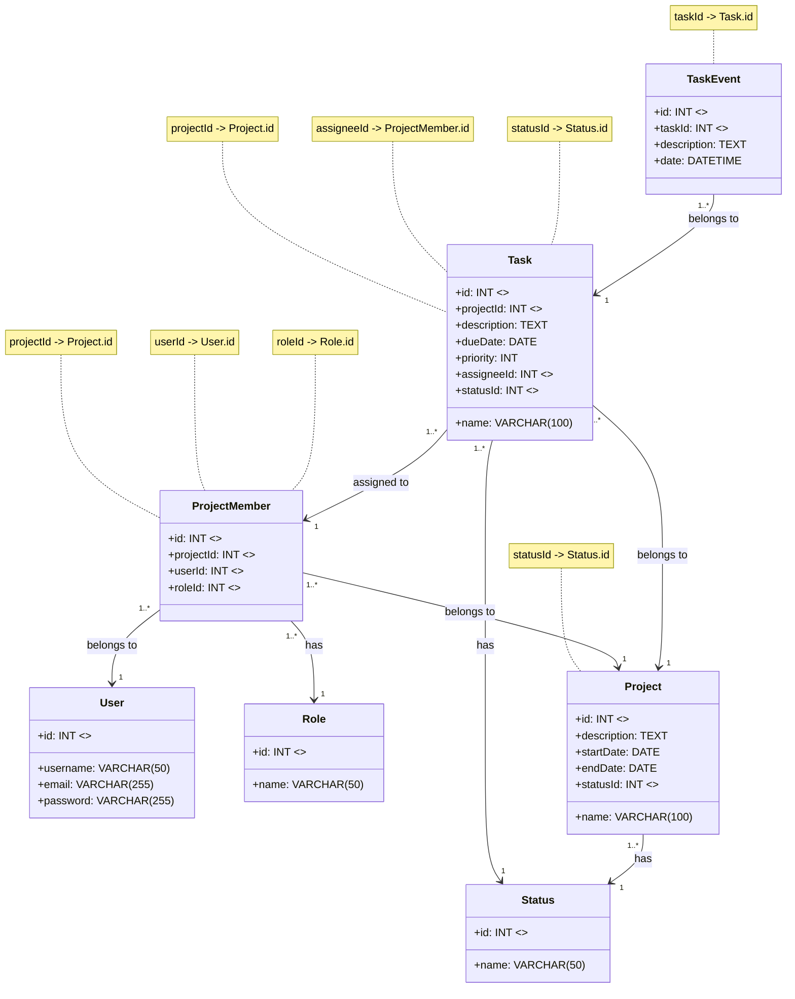

# Modèle de données

```mermaid
classDiagram
    %% Entities
    class User {
        +id: INT <<PK>>
        +username: VARCHAR(50)
        +email: VARCHAR(255)
        +password: VARCHAR(255)
    }

    class Role {
        +id: INT <<PK>>
        +name: VARCHAR(50)
    }

    class Status {
        +id: INT <<PK>>
        +name: VARCHAR(50)
    }

    class Project {
        +id: INT <<PK>>
        +name: VARCHAR(100)
        +description: TEXT
        +startDate: DATE
        +endDate: DATE
        +statusId: INT <<FK>>
    }

    class Task {
        +id: INT <<PK>>
        +projectId: INT <<FK>>
        +name: VARCHAR(100)
        +description: TEXT
        +dueDate: DATE
        +priority: INT
        +assigneeId: INT <<FK>>
        +statusId: INT <<FK>>
    }

    class TaskEvent {
        +id: INT <<PK>>
        +taskId: INT <<FK>>
        +description: TEXT
        +date: DATETIME
    }

    class ProjectMember {
        +id: INT <<PK>>
        +projectId: INT <<FK>>
        +userId: INT <<FK>>
        +roleId: INT <<FK>>
    }

    %% Relationships with correct UML notation
    ProjectMember "1..*" --> "1" Project : belongs to
    ProjectMember "1..*" --> "1" User : belongs to
    ProjectMember "1..*" --> "1" Role : has
    Task "1..*" --> "1" Project : belongs to
    Task "1..*" --> "1" ProjectMember : assigned to
    Task "1..*" --> "1" Status : has
    TaskEvent "1..*" --> "1" Task : belongs to
    Project "1..*" --> "1" Status : has

    %% Notes for foreign key relationships
    note for Project "statusId -> Status.id"
    note for Task "projectId -> Project.id"
    note for Task "assigneeId -> ProjectMember.id"
    note for Task "statusId -> Status.id"
    note for TaskEvent "taskId -> Task.id"
    note for ProjectMember "projectId -> Project.id"
    note for ProjectMember "userId -> User.id"
    note for ProjectMember "roleId -> Role.id"
``` 