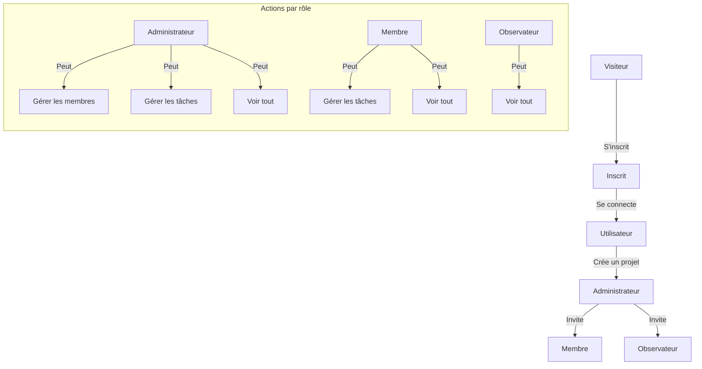

# Documentation des Fonctionnalités

## Gestion des Utilisateurs

### Inscription
En tant que visiteur, je veux pouvoir m'inscrire avec :
- Un nom d'utilisateur
- Une adresse e-mail
- Un mot de passe

### Connexion
En tant qu'inscrit, je veux pouvoir me connecter avec :
- Adresse e-mail
- Mot de passe

## Gestion des Projets

### Création de Projet
En tant qu'utilisateur, je peux créer un projet avec :
- Nom
- Description
- Date de début
→ Je deviens automatiquement administrateur du projet

### Gestion des Membres
En tant qu'administrateur du projet, je peux :
- Inviter des membres via leur e-mail
- Attribuer des rôles aux membres

## Tableau des Permissions par Rôle

| Action                                    | Administrateur | Membre | Observateur |
|------------------------------------------|---------------|---------|-------------|
| Ajouter un membre et lui attribuer un rôle| ✓             |         |             |
| Créer une tâche                          | ✓             | ✓       |             |
| Assigner une tâche                       | ✓             | ✓       |             |
| Mettre à jour une tâche                  | ✓             | ✓       |             |
| Visualiser une tâche unitairement        | ✓             | ✓       | ✓           |
| Visualiser le tableau de bord            | ✓             | ✓       | ✓           |
| Être notifié                             | ✓             | ✓       | ✓           |
| Voir l'historique des modifications      | ✓             | ✓       | ✓           |

## Gestion des Tâches

### Création de Tâche
En tant qu'administrateur ou membre, je peux créer une tâche avec :
- Nom
- Description
- Date d'échéance
- Priorité

### Attribution de Tâche
En tant qu'administrateur ou membre, je peux :
- Assigner une tâche à un membre spécifique du projet

### Mise à jour de Tâche
En tant qu'administrateur ou membre, je peux modifier :
- Toutes les informations de la tâche
- Ajouter une date de fin

### Visualisation des Tâches
En tant qu'administrateur, membre ou observateur, je peux :
- Voir toutes les informations d'une tâche unitaire
- Visualiser les tâches par statut sur un tableau de bord

## Notifications et Suivi

### Notifications
En tant qu'administrateur, membre ou observateur :
- Je reçois des notifications par e-mail lors de l'attribution d'une tâche

### Historique
En tant qu'administrateur, membre ou observateur :
- Je peux suivre l'historique des modifications des tâches 